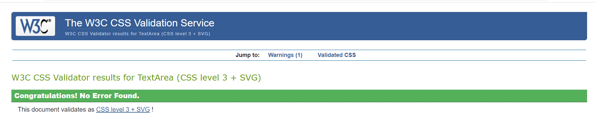

# Nutshell
Want to skip candies and other sweets but still enjoy snacking? Buy organic dried fruits online for healthy
snacking. For nut enthusiasts, Nutshell is the finest site to buy nuts online. Discover nutritious snacks
for adults as well as healthy snacks for children.

# Table of contents
* [Design](#design)
    - [Wireframes](#design)
    - [Database schema](#database-schema)
    - [Color scheme](#color-scheme)
* [UX](#ux)
    - [Site-Goals](#site-goals)
    - [The site's ideal user](#the-site's-ideal-user)
* [Agile Development](#agile-development)
    - [Epics](#epics)
    - [User Stories](#user-stories)
    - [Scope](#scope)
* [Features](#features)
* [Testing](#testing)
    - [Bugs](#bugs)
    - [Unsolved bugs](#unsolved-bugs)
    - [Validator Testing](#validator-testing)
    - [Manual Tests](#manual-tests)
* [Deployment](#deployment)
    - [Heroku](#heroku)
    - [Clone the repository](#clone-the-repository)
* [Credits](#credits)

# Design

## Wireframes
Some additional elements that are not apparent on the wireframes were incorporated during the site's development, so the wireframes differ slightly from the actual website.

## Database schema
Several models were created for the development of the site. First of all, in order for the customers to view products, a Products model was created which had category and subcategory as foreign keys. A category and subcategory model was then created to link it up with the product model. For the checkout app two models were created, one for the orders (Order) and one for the order items (OrderLineItem). Furthermore to create some custom models, a Wishlist model and product rating model was created that had user as ForiegnKey. 

## Color scheme
The color scheme was carefully designed and chosen to ensure that the site has a great color contrast. Furthermore, when selecting colors, the fact that the store is a selling healthy and natural food/fruits was taken into account in order to provide users with a green and natrual atmosphere and environment.

# UX
## Site-Goals
Nutshell is a BtC ecommerce website. The site's goal is to allow external users to order one or more items from the site. External users can also have a Wishlist and leave product review on the products in the website. The site also seeks to provide store owners with the option to manage their store's products and customer as well as their payment system.

## The site's ideal user
- The ideal user is a dry friuts lover and nuts lover. 
- Someone who is training and looks for nutritious snacks.
- Someone who wishes to substitute unhealthy candy and chips with natural, delectable, and nutritious snacks.

# Agile Development
Agile Methodology was used to create the website. Github was used for agile project planning for this project. The issues on Github were used to build user stories and label them to ensure that the sites' fundamental requirements were met. The user stories defined the issue's aim and included an acceptance criteria section to identify the functionality that marked the user story as complete. The 24 user stories were then organized into 5 epics. Following that, a kanban board with four separate columns was made using github projects. The columns were no status, to do, in progress, and done.

### Epics
- Website's foundations
- Ordering functionality
- Admin site control
- Product viewing
- Authentication

### User Stories
- Website's foundations:
    * As a User  I can easily navigate through the site’s pages So that I can access different sections and pages of the site.
    * As a User I can feel welcomed by the home page so that I get attracted to buy products from the site.
    * As a User  I can find new offers on the site So that I more often visit and buy products from the site.
    * As a User I can search for a desired item so that  I can bypass the navigation and search for what I want.
    * As a User I can find a footer So that I can access the site’s social media and newsletter subscription.
        
- Ordering functionality:
    * As a  User I can place an order  So that I can purchase desired products.
    * As a  User I can view a summary of my order before payment So that I can make sure that I purchase the right items.
    * As a  User I can receive an order confirmation email So that I can be informed that my order is being processed.
    * As a Logged in User I can view my order history So that I can keep track of my orders.
    * As a Logged in User I can get my checkout form prefilled with the saved data in my profile So that it is easier to proceed with the checkout.

- Admin site control
    * As a Site Admin I can navigate to the admin page from the navbar So that I can easily access the site’s backend.
    * As a Site Admin I can login to my account So that I can access and manage the site’s backend.
    * As a Site Admin I can perform full CRUD functionality on the products of the site So that I can manage my store.
    * As a Site Admin I can find a product management page So that I can easily manage the store’s products.

- Product viewing

     * As a User I can view a list of products So that I can choose one to add to my shopping cart.
     * As a User I can view related products to the currently selected one So that If necessary, I may add similar products to the basket.
     * As a User I can view customer reviews and ratings of a product So that it can help me make purchasing decisions.
     * As a User I can sort products based on categories So that I can view products of a desired category.
     * As a User I can sort products based on price so that I can view products of desired price range. 

- Authentication
    * As a User I can register for an account So that I can view my order history
    * As a  User I can find the logout/login button in the navbar So that I can easily access my profile.
    * As a  Logged in User I can save desired products to my wishlist So that I can visit the site back and buy them later.
    * As a  User I can save my shipping details in my profile So that my checkout form is prefilled.
    * As a User I can get an order confirmation email So that I can verify that my order was successful.

### Scope
* Reponsive Design.
* Product Ordering.
* Customer Product Review .
* Restricted role based features.
* Products page with sorting based on category and price.
* Landing page with information about the Store.
* Userprofile page with order history.

# Features
- Navigation bar
    * This section includes the logo of the site and a responsive navigation bar with a hamburger menu for smaller screens. This header is present in all of the site’s pages.
    * The nav bar allows users to easily navigate from one section to another and it is responsive for mobile screens with the navigation links turning into a hamburger menu.
    * The users can also click on a category so that the may render all products of that category.
    * The navbar allows users to search for a single product and skip all navigation.
    * For logged in users a link to their 'My Profile' page is added and for a logged in admin user a link to the admin page is added. 

- Landing page
    * The landing page includes a welcoming message and a CTA button for shopping. It also consists of a image of some of the products of the store.
    * The landing page introduces the users to Nutshell and welcomes them to the store site while the CTA button on this section encourages users to view the products and adding them to thier cart. 

- Products page
    * This page displays all of the store’s products. 
    * There are sorting options based on price, category and subcategory. 
    * The products are all presented as cards. The cards include the item's name and price, a picture of the menu item and a button to add it to the cart.
    * This section allows customers to see all of the products that the store offers so that they add it to their shopping bag and order it. 

- Shopping cart
    * This section includes all the products that the user adds to their shopping cart.
    * The products are displayed in a table with important table headers.
    * Users can also increment or decrement the quantity of the products in this section.
    * A summary of the shopping cart is als presented with the total price and a button to the checkout page.
 

- Footer 
    * The footer consists of links to the restaurant's social media accounts so that the user can access.
    * It also consists of a subscription form that the users can submit to subscribe to the store’s newsletter. 

- Wishlist page
    * The wishlist page renders the products that logged in users add to their wishlist.
    * The products are presented in cards with the name, image and price of the product.
    * The users have the option to add it to their cart or remove it from their wishlist.
 

- My Profile
    * In this page the users can change or add their shipping information with which the checkout form is prefilled.
    * The users can also view a history of their orders. 

## Future Features
Some Future features that can be implemented are:
- The ability for users to choose a specic amount of the products to buy.
- Sorting based on product rating.
- A seperate offers section in the landing page.

## Technologies Used

During the development of this project serveral technologies have been used:

- [Django](https://www.djangoproject.com/)
    - Django is the main framework that was utilized to create the overarching project and its applications.
- [Python](https://www.python.org/)
    - Python was used to write the core logic of the site.
- [Bootstrap](https://getbootstrap.com/)
    - Bootstrap was used to creat and design a responsive site.
- [Font Awesome](https://fontawesome.com/)
    - Fontawesome icons are used throughout the website.
- [Google Developer Tools](https://developers.google.com/web/tools/chrome-devtools)
    - Google developer tools was used to detect bugs and manage responsivness.
- [GitHub](https://github.com/)
    - Github is used to store the code of this project.
- [Git](https://git-scm.com/)
    - Git was used for version control
- [Gitpod](https://www.gitpod.io/)
    - Gitpod was used as the development environment.
- [Heroku](https://dashboard.heroku.com/apps)
    - Heroku was used to deploy and host the project.
- [Lucid](https://lucid.app/documents#/dashboard)
    - Lucid was used to create the database schema.
- [AWS](https://aws.amazon.com/)
    - AWS was used to store the static files of the site.
- [Favicon.io](https://favicon.io/)
    - Favicon was used to create favicon's for the site.
- [SQLite](https://www.sqlite.org/index.html)
    - SQLite was used to run the database locally under development.
- [ElephantSQL](https://www.elephantsql.com/)
    - ElephantSQL was used to store the data of the site.

# Testing
## Validator Testing

- HTML
    * Validated using [W3C](https://validator.w3.org/) HTML validator and some minor errors were found.
    

- CSS
    * Validated using [Jigsaw](https://jigsaw.w3.org/css-validator/) validator and no errors were found.
    

- JavaScript
    * Validated using [JsHint](https://jshint.com/) validator and no errors were found.

- Python
    * Validated using [CI Python Linter](https://pep8ci.herokuapp.com/) validator and no errors were found except in the settings.py file.

- I have also checked and tested the site on different browsers such as Chrome, Firefox, Edge and Safari. By using the chrome dev tools and [Am I Responsive?](https://ui.dev/amiresponsive?url=https://8000-jalalk1244-nutshell-zdg4423b77t.ws-eu82.gitpod.io/) website have i also checked and confirmed the responsiveness of the site.

- Lighthouse report (Chrome dev-tool)  
    
## Marketing
- Users are also able to subscribe to receive the gallery's newsletter, using the MailChimp form found in the footer.

- A Facebook business page was also created

## Manual Tests

**Authentication**

Description:

Ensure a user can sign up to the website

Steps:

1. Navigate to [Nutshell](https://nutshell.herokuapp.com/) and click on the account icon
2. Click on the sign up link
3. Enter email, username, first name, last name and password 
3. Click Sign up

Expected:

The user is asked to confirm thier email adress

Actual: 

The user is asked to confirm thier email adress

Description:

Ensure a registered user can login in to the website with thier login info

Steps:

1. Navigate to Navigate to [Nutshell](https://nutshell.herokuapp.com/) and click on the account icon
2. Click on the login link
3. Enter username or email and password
3. Click sign in

Expected:

The user is logged in with thier account and redirect to home page

Actual: 

The user is logged in with thier account and redirect to home page

Description:

Ensure a user can sign out

Steps:

1. Login to the website
3. click the account icon
2. Click the logout link
3. Click confirm on the confirm logout page

Expected:

User is logged out

Actual:

User is logged out

**Website's foundations**
Description:

Ensure that the home page with navbar and footer displays on loading the page

Steps:

1. Navigate to Navigate to [Nutshell](https://nutshell.herokuapp.com/)

Expected:

A landing page with CTA button and website description message with footer and navbar

Actual:

A landing page with CTA button and website description message with footer and navbar

Description:

Ensure that the links in the navbar are linking to the right page

Steps:

1. Navigate to Navigate to [Nutshell](https://nutshell.herokuapp.com/)
2. Click on any of the navbar links

Expected:

if clicked on the Logo, redirected to the index.html page 
if clicked on Cart icon, redirected to the bag.html page 
if clicked on heart icon , redirected to the wishlist.html page 
if clicked on any category, redirected to the products.html page with products from that category rendering 
if clicked on Reservations, redirected to the create_reservation.html 
if clicked on account icon then login, redirected to the Allauth sign in page 
if clicked on account icon then signup, redirected to the Allauth signup page

Actual:

if clicked on the Logo, redirected to the index.html page 
if clicked on Cart icon, redirected to the bag.html page 
if clicked on heart icon , redirected to the wishlist.html page 
if clicked on any category, redirected to the products.html page with products from that category rendering 
if clicked on Reservations, redirected to the create_reservation.html 
if clicked on account icon then login, redirected to the Allauth sign in page 
if clicked on account icon then signup, redirected to the Allauth signup page

Description:

Ensure that the subscription form is working

Steps:
1. Navigate to Navigate to [Nutshell](https://nutshell.herokuapp.com/) and then the footer
2. Enter a valid email address
3. Click subscribe

Expected:

The email address added to the mailchimp audience

Actual:

The email address added to the mailchimp audience

**Ordering functionality**

Description:

Ensure that products can be added to the cart

Steps:
1. Navigate to [Nutshell](https://nutshell.herokuapp.com/) and click shop now button
2. Click on a desired product
3. Choose quantity
3. Click Add to cart

Expected: 

The selected product added to the cart list in the bag.html page

Actual : 

The selected product added to the cart list in the bag.html page

Description:

Ensure that checkout form can be sent

Steps:
1. Navigate to [Nutshell](https://nutshell.herokuapp.com/)  and add som products to your cart
2. Click checkout
3. Fill in the checkout form and click complete order

Exepected: 

If the details are correct redirect to the checkout success page with a order confirmation email sent to the given email

Actual:

If the details are correct redirect to the checkout success page with a order confirmation email sent to the given email

# Deployment

- Live site can be viewed here: https://nutshell.herokuapp.com/

## Heroku
To deploy my project to Heroku I applied these steps:
- Go to [Heroku.com](https://heroku.com/) and log in or create an account if you don't already have one
- Click the New dropdown and select Create New App.
- Enter a valid name for the project
- Select region and click create app
- Go to settings tab and click reveal config vars
- Add the below config vars:
    * AWS_ACCESS_KEY_ID
    * AWS_SECRET_ACCESS_KEY
    * DATABASE_URL
    * EMAIL_HOST_PASS
    * EMAIL_HOST_USER
    * PORT
    * SECRET_KEY
    * STRIPE_PUBLIC_KEY
    * STRIPE_SECRET_KEY
    * STRIPE_WH_SECRET
    * USE_AWS
- Navigate to the deploy page
- Connect github account and search for the repository
- Click deploy  
The app should now be deployed

## Clone the repository
To clone the repository:
- Navigate to https://github.com/jalalk1244/nutshell
- click on the code button at the top of the file
- Choose HTTPS and copy the link
- Navigate to your editors terminal, where git must be installed
- Type git clone URL
- Replace URL with the copied link
- Press enter

# Credits

## Content

- [Customize allauth forms](https://www.geeksforgeeks.org/python-extending-and-customizing-django-allauth/)
- [Crispy Forms](https://django-crispy-forms.readthedocs.io/en/latest/)
- [Django Allauth](https://django-allauth.readthedocs.io/en/latest/installation.html)
- [Sending email with django](https://www.youtube.com/watch?v=xNqnHmXIuzU&t=438s)
- Chekout functionality:
    * Boutique Ado Walkthrough

